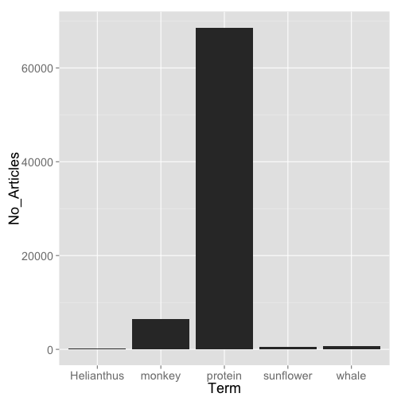

## rOpenSci Demo

[rOpenSci](http://ropensci.org/)

### Getting data from the literature - PLOS

This example demonstrates how you can easily get literature data from Public Library of Science from R. 

#### Install rplos


```r
install.packages(c("rplos", "tm"))
```


#### Load rplos


```r
library(rplos)
```


#### Search for mentions of Fisher in the author field, returning title and author fields, searching in full papers (not including figure captions, etc.), returning only 25 results.


```r
key <- "key"
out <- searchplos(terms = "author:\"Fisher\"", fields = "title,author", toquery = "doc_type:full", 
    limit = 25, key = key)
head(out)  # first six rows
```

```
##                              author
## 1     Qianru Zhang; Kimberly Fisher
## 2                  Matthew C Fisher
## 3 Masashi Yoshimura; Brian L Fisher
## 4  Diana O Fisher; Simon P Blomberg
## 5      Brian L Fisher; M Alex Smith
## 6   Daniel A Henk; Matthew C Fisher
##                                                                                                                                            title
## 1                                  Tight Junction-Related Barrier Contributes to the Electrophysiological Asymmetry across Vocal Fold Epithelium
## 2                                                                                              Silent Springs: Why Are All the Frogs “Croaking”?
## 3        A Revision of Male Ants of the Malagasy Amblyoponinae (Hymenoptera: Formicidae) with Resurrections of the Genera Stigmatomma and Xymmer
## 4                                                            Costs of Reproduction and Terminal Investment by Females in a Semelparous Marsupial
## 5                                          A Revision of Malagasy Species of Anochetus Mayr and Odontomachus Latreille (Hymenoptera: Formicidae)
## 6 The Gut Fungus Basidiobolus ranarum Has a Large Genome and Different Copy Numbers of Putatively Functionally Redundant Elongation Factor Genes
```


#### Quickly visualize variation in frequency of word usage in PLOS journals


```r
library(ggplot2)
plosword(list("monkey", "Helianthus", "sunflower", "protein", "whale"), key = key, 
    vis = TRUE)$plot + theme_grey(base_size = 18)
```

 


#### Get abstracts of 500 papers, and use the tm package for text mining. 

Get 500 abstracts from PLOS One only. The `*:*` is special syntax to denote *give back everything*


```r
out <- searchplos(terms = "*:*", fields = "abstract", toquery = list("cross_published_journal_key:PLoSONE", 
    "doc_type:full"), limit = 500, key = key)
out$abstract[1:3]  # take a peek
```

```
## [1] "Background: Long-term potentiation (LTP) at the parallel fibre–Purkinje cell synapse in the cerebellum is a recently described and poorly characterized form of synaptic plasticity. The induction mechanism for LTP at this synapse is considered reciprocal to “classical” LTP at hippocampal CA1 pyramidal neurons: kinases promote increased trafficking of AMPA receptors into the postsynaptic density in the hippocampus, whereas phosphatases decrease internalization of AMPA receptors in the cerebellum. In the hippocampus, LTP occurs in overlapping phases, with the transition from early to late phases requiring the consolidation of initial induction processes by structural re-arrangements at the synapse. Many signalling pathways have been implicated in this process, including PI3 kinases and Rho GTPases. Principal Findings: We hypothesized that analogous phases are present in cerebellar LTP, and took as the starting point for investigation our recent discovery that P-Rex – a Rac guanine nucleotide exchange factor which is activated by PtdIns(3,4,5)P3 – is highly expressed in mouse cerebellar Purkinje neurons and plays a role in motor coordination. We found that LTP evoked at parallel fibre synapses by 1 Hz stimulation or by NO donors was not sustained beyond 30 min when P-Rex was eliminated or Rac inhibited, suggesting that cerebellar LTP exhibits a late phase analogous to hippocampal LTP. In contrast, inhibition of PI3 kinase activity eliminated LTP at the induction stage. Conclusions: Our data suggest that a PI3K/P-Rex/Rac pathway is required for late phase LTP in the mouse cerebellum, and that other PI3K targets, which remain to be discovered, control LTP induction."
## [2] "The small Rho G-protein Rac1 is highly conserved from fungi to humans, with approximately 65% overall sequence identity in Candida albicans. As observed with human Rac1, we show that C. albicans Rac1 can accumulate in the nucleus, and fluorescence recovery after photobleaching (FRAP) together with fluorescence loss in photobleaching (FLIP) studies indicate that this Rho G-protein undergoes nucleo-cytoplasmic shuttling. Analyses of different chimeras revealed that nuclear accumulation of C. albicans Rac1 requires the NLS-motifs at its carboxyl-terminus, which are blocked by prenylation of the adjacent cysteine residue. Furthermore, we show that C. albicans Rac1 dynamics, both at the plasma membrane and in the nucleus, are dependent on its activation state and in particular that the inactive form accumulates faster in the nucleus. Heterologous expression of human Rac1 in C. albicans also results in nuclear accumulation, yet accumulation is more rapid than that of C. albicans Rac1. Taken together our results indicate that Rac1 nuclear accumulation is an inherent property of this G-protein and suggest that the requirements for its nucleo-cytoplasmic shuttling are conserved from fungi to humans."                                                                                                                                                                                                                                                                                                                                                                                                                                                                                               
## [3] "Background: Treatment of pediatric T-cell acute lymphoblastic leukemia (T-ALL) has improved, but there is a considerable fraction of patients experiencing a poor outcome. There is a need for better prognostic markers and aberrant DNA methylation is a candidate in other malignancies, but its potential prognostic significance in T-ALL is hitherto undecided. Design and Methods: Genome wide promoter DNA methylation analysis was performed in pediatric T-ALL samples (n = 43) using arrays covering >27000 CpG sites. Clinical outcome was evaluated in relation to methylation status and compared with a contemporary T-ALL group not tested for methylation (n = 32). Results: Based on CpG island methylator phenotype (CIMP), T-ALL samples were subgrouped as CIMP+ (high methylation) and CIMP− (low methylation). CIMP− T-ALL patients had significantly worse overall and event free survival (p = 0.02 and p = 0.001, respectively) compared to CIMP+ cases. CIMP status was an independent factor for survival in multivariate analysis including age, gender and white blood cell count. Analysis of differently methylated genes in the CIMP subgroups showed an overrepresentation of transcription factors, ligands and polycomb target genes. Conclusions: We identified global promoter methylation profiling as being of relevance for subgrouping and prognostication of pediatric T-ALL."
```


Load the tm package, and create a document library


```r
library(tm)
(corpus <- Corpus(VectorSource(out$abstract)))
```

```
## A corpus with 500 text documents
```


Create a term-document matrix from the corpus, and inspect it. 


```r
tdm <- DocumentTermMatrix(corpus, control = list(removePunctuation = TRUE, stopwords = TRUE, 
    removeNumbers = TRUE))
inspect(tdm[1:5, 1:5])
```

```
## A document-term matrix (5 documents, 5 terms)
## 
## Non-/sparse entries: 0/25
## Sparsity           : 100%
## Maximal term length: 15 
## Weighting          : term frequency (tf)
## 
##     Terms
## Docs   activedisease   nosymptom aacib aada aanas
##    1               0           0     0    0     0
##    2               0           0     0    0     0
##    3               0           0     0    0     0
##    4               0           0     0    0     0
##    5               0           0     0    0     0
```


Various operations on document term matrices


```r
# find terms that occur at least five times across documents
findFreqTerms(tdm, 250)
```

```
## [1] "cell"       "cells"      "expression" "patients"   "results"   
## [6] "study"
```

```r

# find associations (terms which correlate) with at least 0.3 correlation
# for the term 'result'
findAssocs(tdm, "cells", 0.3)
```

```
##                  cell         counteractive            delineates 
##                  0.43                  0.31                  0.31 
##                ductal              exocrine               ghrelin 
##                  0.31                  0.31                  0.31 
##     ghrelinexpressing      ghrelinproducing      hormoneproducing 
##                  0.31                  0.31                  0.31 
##        insufficiently      insulinproducing                 islet 
##                  0.31                  0.31                  0.31 
##                  mark           multipotent            neurogenin 
##                  0.31                  0.31                  0.31 
##              ontogeny             pancreata  polypeptideproducing 
##                  0.31                  0.31                  0.31 
##                retain somatostatinproducing                  stem 
##                  0.31                  0.31                  0.31 
##            terminally            epithelial 
##                  0.31                  0.30
```

